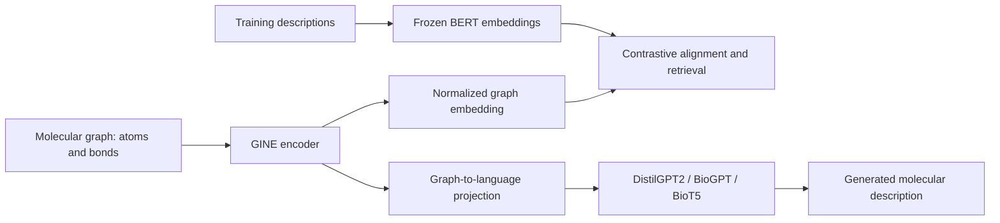

# Molecular Graph Captioning — ALTeGraD Multimodal Challenge

MVA / ALTeGraD coursework, 2025–2026, organized for **Ying Jin's project portfolio**. The task connects molecular graphs to natural-language descriptions. This repository keeps the multimodal challenge separate from the ALTeGraD practical assignments.

The code explores two approaches: learn a shared graph–text space and retrieve a description, or condition a language model on graph representations and generate one. It includes a feature-aware GINE retrieval model, a frozen-GNN/DistilGPT2 generator, and BioGPT/BioT5 experiments with LoRA.

## Approaches

| Approach | Graph / language components | Entry point |
|---|---|---|
| Contrastive retrieval | GINE with nine atom and three bond feature fields; frozen BERT description embeddings; symmetric InfoNCE | `train_retrieval.py`, `retrieve_descriptions.py` |
| Graph-conditioned GPT2 | Frozen retrieval GINE; one projected graph-prefix token; trainable DistilGPT2 and projector | `train_graph_gpt2.py`, `generate_graph_gpt2.py` |
| Graph-conditioned BioGPT | Trainable GINE node tokens prepended to the text embeddings of a causal LM; LoRA | [`notebooks/graph_biogpt.ipynb`](notebooks/graph_biogpt.ipynb) |
| Graph-conditioned BioT5 | Trainable GINE node representations supplied to a sequence-to-sequence model; LoRA | [`notebooks/graph_biot5.ipynb`](notebooks/graph_biot5.ipynb) |

The supplied course baseline used a feature-free GCN and an MSE graph/text alignment objective. The selected retrieval implementation uses categorical atom/bond embeddings, GINE message passing and a bidirectional contrastive loss. Despite its original filename `train_gcn.py`, its active convolutions are GINE.



## Repository guide

- `data_utils.py`: graph datasets, text-embedding CSV loading and graph/text collation, adapted within the course scaffold.
- `generate_description_embeddings.py`: frozen `bert-base-uncased` CLS embeddings for training and validation descriptions.
- `train_retrieval.py`: three-layer GINE, hidden width 128, graph pooling and projection; batch 32, 20 epochs, Adam at 1e-3, contrastive temperature 0.07.
- `retrieve_descriptions.py`: map test graphs to the closest training-description embedding and write an `ID,description` CSV.
- `train_graph_gpt2.py`: freeze a trained retrieval encoder and train the projector/DistilGPT2; batch 32, 10 epochs, learning rate 1e-4.
- `generate_graph_gpt2.py`: generate descriptions from a saved GraphGPT checkpoint.
- `notebooks/`: cleaned Colab experiments; outputs and session metadata removed.
- [`docs/PROVENANCE.md`](docs/PROVENANCE.md): source versions, maintenance changes, attribution and validation scope.

## Setup and data

Use Python 3.10+ in a separate environment. Choose a PyTorch build suited to your machine, then install the listed dependencies:

```bash
python -m venv .venv
# Activate .venv using your shell's command.
python -m pip install -r requirements.txt
```

The dependency lists are inferred from imports and are not a tested environment lock. Obtain the challenge data through the authorized course/competition channel. Put the trusted graph files in:

```text
data/train_graphs.pkl
data/validation_graphs.pkl
data/test_graphs.pkl
```

See [`data/README.md`](data/README.md) for the expected fields and ID format. Data, pretrained weights, generated submissions and embedding CSVs are not redistributed. The loaders use pickle; only load files from a trusted source.

## Retrieval workflow

Run from the repository root:

```bash
python generate_description_embeddings.py
python train_retrieval.py
python retrieve_descriptions.py
```

The first command downloads BERT if needed and creates local embedding CSVs. Training writes `model_checkpoint.pt`; inference writes `All_features_retrieved_descriptions.csv`. These are full preparation/training commands, not smoke tests.

Validation in the saved code computes **text-to-graph** MRR and recall within the validation pool. Test prediction performs **graph-to-training-text** retrieval. They have different directions and candidate pools; the validation values should not be presented as an official captioning score.

## DistilGPT2 workflow

First produce a compatible 768-dimensional retrieval encoder checkpoint using the BERT workflow above:

```bash
python train_graph_gpt2.py
python generate_graph_gpt2.py --model_path checkpoints_gen/best_model.pth --output_csv graph_gpt2_predictions.csv
```

The trainer saves `best_model.pth` when validation is available and improves, and `last_model.pth` after each epoch. It stops if the pretrained GNN checkpoint is missing or incompatible. The generator uses greedy decoding with a cached-prefix fallback. Training constants are near the top of `main()`.

## BioGPT and BioT5 notebooks

Install the additional dependencies with `pip install -r requirements-notebooks.txt`, or configure the setup cells in Colab for your runtime. The notebooks retain their historical Colab installation and Drive-mount workflow; update those cells and paths before running elsewhere. In particular, their CUDA 11.8 installation command is not a universal hardware recommendation.

| Saved notebook configuration | BioGPT | BioT5 |
|---|---|---|
| Language model | `microsoft/biogpt` | `QizhiPei/biot5-base` |
| GINE depth / hidden width | 5 / 128 | 5 / 256 |
| Epochs | 1 | 4 |
| LoRA rank / alpha | 4 / 8 | 16 / 32 |
| Batch / accumulation | 2 / 8 | 2 / 8 |

These are the configurations currently saved in the notebooks. They are not inferred from old prediction filenames, and do not establish which version was submitted to the competition.

## Status and attribution

This is a curated implementation release from local coursework files and a named project archive. Original course utilities and baseline ideas are credited; the repository does not claim every line was written from scratch. A complete collaborator/contribution record and a final report were not present in the selected sources, so no additional author names or individual responsibility claims are invented.

Packaging checks on 23 September 2026 covered six Python modules, syntax of 34 notebook code cells, local import/entry-point consistency, and removal of data, weights and notebook outputs. Several interface/path issues and the GPT2 padding-label mask were corrected in the maintained copy; details are in the provenance document. Training was not rerun, GPU compatibility was not tested, and no leaderboard rank or performance improvement is claimed for this release. Exact historical reproduction would require the original environment, seeds, data and checkpoints.

No repository-wide software license is added where the coursework's original licensing was not documented. Existing course and model terms remain applicable.
